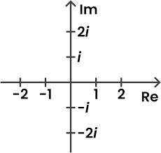

## Threading Extra

### Topics
1. Mandelbrot Fractal
2. No Threads
3. Threading It Up - Making Mandelbrot Threadable
4. Executers
5. Safe Threading

**Source Repository **
* Unthreaded Version https://github.com/andyguestysj/UnThreaded.git
* Threaded Version https://github.com/andyguestysj/Threading.git

## Mandelbrot Fractal

Mandelbrot Video - <div style="position:relative;padding-bottom:56%;padding-top:20px;height:0;"><iframe src="https://hml.yorksj.ac.uk/player?autostart=n&videoId=BGe2dhe5&captions=y&chapterId=0&playerJs=n" frameborder="0" scrolling="no" style="position:absolute;top:0;left:0;width:100%;height:100%;" allowfullscreen></iframe></div>

From [Wikipedia](https://en.wikipedia.org/wiki/Mandelbrot_set)

"The Mandelbrot set is a two-dimensional set that has a relatively simple definition yet exhibits complext structures when visualised."


Completely explaining how the Mandelbrot set is calculated is beyond the scope of this session. You can find many explanations online, explaining it in many different ways. A good starting point is the (Wikipedia article)[https://en.wikipedia.org/wiki/Mandelbrot_set].

The quick and dirty explanation is something like this.

The square root of -1 is a number that doesn't exist since anything squared is positive. Unfortunately using the square root of -1 is often useful so mathematicians came up with the idea of *i* to represent is.

$$i=\sqrt{-1}$$

Now we can calulate the square root of negative numbers.

$$\sqrt{-4} = \sqrt{4} * \sqrt{-1} = 2 * i$$

*i* has an interesting property.

$i=\sqrt{-1}$

$i^2 = -1$

$i^3 = -i$

$i^4 = 1$

$i^5 = i$

So if we take *i* and keep multiplying itself we will go round and round in circles forever.

If you picture the complex plane, a chart with real numbers along the x-axis and imaginary numbers (i.e. numbers multiplied by *i*) along the y-axis, you can picture this cycle. *i* starts at 1 on the y-axis. $i^2$ is -1, or -1 on the x-axis. $i^3$ is $-i$ which is -1 on the y-axis. $i^4$ is 1, or 1 on the x-axis. And finally $i^5$ is $i$ which is 1 on the y-axis.



That's kinda interesting but generally so what?

It gets more interesting when we look at complex numbers in the form $x+iy$. If we take a number like $1 + 2i$ and square it we get ${1+2i}^2=1 + 4i + {2i}^2 = 1 + 4i + 4i^2 = 1 + 4i + (4\times1) = -3 + 4i$. If we plot $1+2i$ and $-3+4i$ we can see that the point has jumped from the top right quadrant to the top left quadrant. 

What happens if we multiply by $1+2i$ again?

$$(-3 + 4i)(1+2i) = -3 + (4i - 6i) + 8i^2 = -3 - 2i  + (8\times-1) = -11 - 2i$$

Now we are in the bottom left quadrant! If we multiply by $1+2i$ again we will end up in the bottom right corner.

This will happen with any number in the form $x+iy$. Multiplying it by itself causes it to move round the quadrants in an anti-clockwise manner.

That's the first step in understanding the Mandelbrot set.

The second step is understanding how the distance from the origin changes as you do this.

If we do this with real numbers its easy to understand. 1 raised to any power is still one, it stays a fixed distance from the origin. Any number bigger than one gets bigger each time you raise it to the next power, it gets further from the origin. Any number smaller than one gets smaller (eg $0.5^2 = 0.25$) and closer to the origin.

Complex numbers are two dimensional ($x+iy$), so we can still calculate the distance from the origin ($\sqrt{x^2+y^2}$). Do they follow the same rules? Mostly they do. Mostly points further than one from the origin get bigger when raised, and points less than one from the origin get smaller.

But when the distance is near one they point moves round the quadrants and sometimes it gets further from the origin and sometimes it gets closer. Sometimes when the distance is more than one from the origin it gets close during the next raise and vice versa. Only by a little bit, it doesn't change distance much.

So what will happen if we keep raising the power of the point forever. Ultimately one of three things must happen.
1. The point eventually gets further and further away from the origin, heading towards, but never reaching, infinity.
2. The point gets closer to the origin, heading towards, but never reaching, the origin
3. The point goes round and round forever.

How do we know which result we'll get for any given point on the complex point, we kinda just have to grind through the process and keep raising it till we find out. Problem is this can take a long time and for some points we can never be certain. So we come up with a compromise solution.

What we do is keep trying till the distance from the origin is greater than 2 or we hit a number of iterations that we are happy to say "that's enough" about.

The distance of 2 is a good guarantee that the point is on its way away from the origin. If its collapsing in towards the origin it will never get there but if it hasn't gone beyond a distance of 2 after some number of repetitions we are happy to say its headed to zero. In practice only the powers of *i* will actually continue on forever.

So what's the point of all this? Well if we take the points in the complex plane where $-1.5<x<0.5$ and $-1<y<1$ and perform this process, raising each to powers of itself until it is further than 2 from the origin or hits a limit of iterations (lets say something like 10,000) what we get is a number of iterations for each point.

If we then plot each point using a color based on the number of iterations it took to reach an answer we get our Mandelbrot fractal.

Phew, that's a chunk of work to make a pretty picture, why does anyone care. Well that wiggily line shows us something about complexity and the chaotic nature of fractals. A small change in the starting position can have a big change on the result. And that change isn't consistant, move the point a little to the left and it might quickly escape, move it a little more to the left and it might never escape, move a little more to the left again and once again it escapes. The border is chaotic - not random, it will lok the same every time you plot it, it is chaotic, small changes can have big effects and where those small changes are applied will have different effects.

That's it. That is the very quick and very dirty guide to the Mandelbrot set. You don't need to understand all this to follow the rest of this session. All you need to know is that calculating all these numbers can take a very long time depending on how small we want our points and how many iterations we set as our giving up point.

## No Threads

Walkthrough Video - <div style="position:relative;padding-bottom:56%;padding-top:20px;height:0;"><iframe src="https://hml.yorksj.ac.uk/player?autostart=n&videoId=Afd4A6f1&captions=y&chapterId=0&playerJs=n" frameborder="0" scrolling="no" style="position:absolute;top:0;left:0;width:100%;height:100%;" allowfullscreen></iframe></div>

I'm going to start with an unthreaded Mandelbrot generator and then thread it up. A repository of the unthreaded version of the code is [here](https://github.com/andyguestysj/UnThreaded.git).

The *Mandelbrot* class is setup to calculate the iterations for point in an area of the complex plane. The *constructor* stores all the details required for the calculations. The *run* method iterates through each point in the area and calls *CalculatePixel* to evaluate each specific pixel. *CalculatePixel* returns the number of iterations required to escape the origin or the maximum number of iterations.

The *ImageMaker* class takes a set of RGB values for each point in the plane and uses them to create an image and store it in a file called *image.jpg* in the project folder. This is a quick and dirty image, not the best looking, not the best colour depth.

The *App* class is a bit of a mess. There is stuff in there that will be used for threading but it can be ignored for the time being.

The *main* method sets up a 2D array called *iterations* to store the iteration counts for each point. It creates a Mandelbrot object for the area we want to plot and then calls the Mandelbrot's run method to evaluate the points.

The *mandelbrotColouringRed* method is fiddly. It is converting the iteration counts for each point to an RGB value. I've bodged this together by plugging in numbers and ranges till I was (mostly) happy with the way the image looks. There are better, more sophisticated colouring systems out there.

The image is then written to a file.

The project at this point is prepped to be changed to use threads. Lets take a look at how.

## Threading It Up - Making Mandelbrot Threadable

Lets start by considering what we can do to improve the app by using threads.

Calculating the Mandelbrot set is a slow process that involves lots of calculations. Luckily for us calculating the results for any single point in the complex plane is completely independent of the calculations for any other point. We could, in theory, have each point calculated in its own thread. We could do that easily enough in the code but there is some overhead in starting threads, get the process running, closing it down tidily and then assigning the next process to the thread and so on. We want to give each process running in a thread enough work to do that its worth the overhead involved.

What I've chosen to do is divide the area up in to horizontal blocks and have each block run as a separate process. I could use vertical blocks or whatever approach I like. I like the horizontal block approach. Its nice and easy to implement. Each process will perform the calculations for every point in each row in a block and the block will be chosen so the area is split evenly between them. We'll set this up using constants in the code so that there are eight blocks with the area divided evenly between them. Eight is an arbitary number, it could be any number, each block could be a single row.

The code, as it stands, treats the block as a single block buts its actually written to support dealing with the area as multiple blocks. We can do this first without using thread, we'll change the code so instead of generating the results in one process (one *Mandelbrot* object), we'll set it up so it does it in eight blocks.

We change the code (in *App.java*) that sets up and runs the *Mandelbrot* as follows.

```java
Mandelbrot mandie = new Mandelbrot(WIDTH, HEIGHT*8, 0, STARTX, ENDX, STARTY, STARTY+height*8, iterations);

mandie.run();
```

becomes

```java
Mandelbrot mandie;        
for (int block = 0; block < THREADS; block++) {
    double threadStartY = STARTY + block * height;
    double threadEndY = STARTY + (block+1) * height;
    mandie = new Mandelbrot(WIDTH, HEIGHT, block, STARTX, ENDX, threadStartY, threadEndY, iterations);      
    mandie.run();
}
```

We loop through the number of blocks we want to use. In each loop we create a *Mandelbrot* object that will perform the calculations for the block and then run it. We aren't using threads so the loop doesn't resume until that *run()* method completes. The loop then defines the next block and continues.

This is a good start. We can now start thinking about threads.

### Mandelbrot.java Changes

We need to make some changes to the *Mandelbrot.java* class so we can execute *run()* in a thread.

First we need to make the class runnable in a thread. We simply change the first line of the class to

```java
public class Mandelbrot implements Runnable{
```

And that's it! That's all we need to do. For the time being at least.

>I'm cheating a little when I say this. I've aleady set up *Mandelbrot* with a *run()* method. A class that inherits from *Runnable* must implement a *run()* method and that method must be the code you want to run in the thread.

## Executers

Now we need to change *App.java* so that instead of creating a *Mandelbrot* object, running it, then creating the next one, it instead creates a number of objects, schedules them in a pool controlled by an executer and runs them all simultaneously. Or at least as many as we want to run simultaneaously.

First we create an *ExecuteService*

```java
ExecutorService executer = Executors.newFixedThreadPool(CONCURRENT_THREADS);
```

This is both the pool in to which we will place each *Mandelbrot* object and the controller that will start then running and detect when they are all finished.

We next change this loop (from above)

```java
Mandelbrot mandie;        
for (int block = 0; block < THREADS; block++) {
    double threadStartY = STARTY + block * height;
    double threadEndY = STARTY + (block+1) * height;
    mandie = new Mandelbrot(WIDTH, HEIGHT, block, STARTX, ENDX, threadStartY, threadEndY, iterations);      
    mandie.run();
```

so that it will use the *ExecuterService* as a pool for the processes (*Mandelbrot run()* methods) as we create them.

```java
Mandelbrot mandie;        
for (int thread = 0; thread < THREADS; thread++) {
    double threadStartY = STARTY + thread * height;
    double threadEndY = STARTY + (thread+1) * height;
    mandie = new Mandelbrot(WIDTH, HEIGHT, thread, STARTX, ENDX, threadStartY, threadEndY, iterations);            
    executer.execute(mandie);
}
```

I've changed the loop counter from blocks to threads for clarity but the real change is instead of calling *mandie.run();* directly we use *executer.execute(mandie);*. This creates the object and puts it in the *executer* pool to be run as soon as a thread is available and, importantly, then immeadiately lets the loop continue. We don't have to wait for the *run()* method to complete.

This is good, we can now create all the objects and send them off, but it raises a different problem. We can't calculate the colours for the pixels or write the image to the file until all the threads are completed. We need some way to wait for the threads to complete. We do this by adding the following lines after the loop.

```java
executer.shutdown();
try{
    executer.awaitTermination(30, TimeUnit.SECONDS);
} catch (InterruptedException e) {
    e.printStackTrace();
}
```

This tells the *ExecuterService* to wail until all the threads in its pool have finished (or they have timed out after thirty seconds), then closes the it down cleanly (with a try catch just in case it isn't so clean). Its your choice how long to make the timeout, you will need to pick a time appropriate for your own code, thirty seconds is plenty long enough for this.

That's us done! We've got our code running in threads, running much faster than it used to because we are taking advantage of multiple cores.

Well almost done. There's one more bit I want to talk about.

## Safe Threading

We've set our code up so each thread is updating the same 2D array - *iterations[][]*. *iterations* is created in *App.java* and a link is passed in to each *Mandelbrot* object so the results from each thread can be collated in a single data structure.

Problems can occur when multiple processes in different threads might try to update a single data structure at the same time. One change can affect the result of another. Now that shouldn't happen in this case, each thread is updating the same data structure but they are updating different parts of it and there shouldn't be a clash. Still its better to be safe than sorry so lets consider how to do that.

The potentially problematic line is line 43 in *Mandelbrot*. It is 

```java
iterations[x][y+(this.row*this.pixelHeight)] = pixelVal;
```

Each thread could try to run this line simultaneaously. We need to add some protection to ensure that only one at a time does this. We'll create a new method shown below.

```java
public synchronized void updateIterations(int x, int y, int itval, int[][] iterations){
  iterations[x][y] = itval;
}
```

All we are doing is taking that update of *iterations* and wrapping it in a *synchronized* method. Being *synchronized* means only one thread can enter/use this method at a time and the change to *iterations* by any thread will be completed before any other thread can try.

We then change

```java
iterations[x][y+(this.row*this.pixelHeight)] = pixelVal;
```

to 

```java
updateIterations(x, y+(this.row*this.pixelHeight), pixelVal, iterations);
```

using the *synchronized* method to make the change.

>**NB** we don't want to make *run()* synchronised, if we did that they we'd be back to having only one *Mandelbrot* object run at a time.

So that's it. We have a safely threaded version of our Mandebrot generator.

### Topics
1. Mandelbrot Fractal
2. No Threads
3. Threading It Up - Making Mandelbrot Threadable
4. Executers
5. Safe Threading

**Source Repository **
* Unthreaded Version https://github.com/andyguestysj/UnThreaded.git
* Threaded Version https://github.com/andyguestysj/Threading.git

## Mandelbrot Fractal